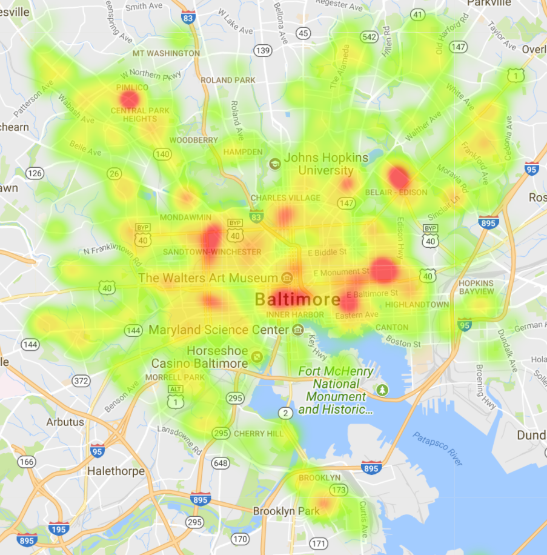
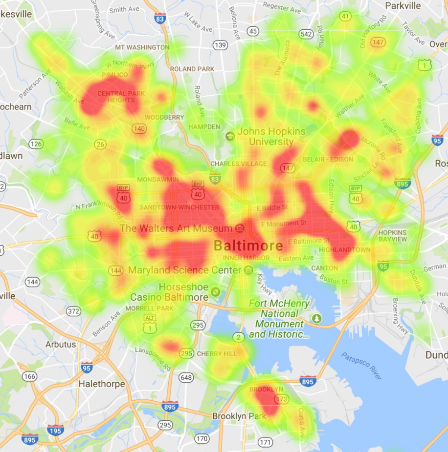

```{r, include = FALSE}
library(tidyverse)
library(caret)
library(rattle)
library(vcd)
library(lubridate)
library(ggmap)
library(rvest)
```


# Goal
To create a heatmap of Baltimore city crime data, in an effort to determine where _NOT_ to live.

# Approach
I plan to create a google fusion table because it has heatmap functionality built in and I might be able to easily overlay it on the housing map I already have (which really would speed things up).

Here my goal is to prep data for fusion table. It needs geocodes for approximate location (which it already has) and I want to take advantage of the optional weights to better represent the dangers as I personally perceive them.

# Import data
```{r download}
dl_date <- Sys.Date()

save_file <- gsub("-", "", dl_date) %>%
    paste0("~/Housing/", ., "-BPD_Part1_crime.csv")
BC_crime_url <- "https://data.baltimorecity.gov/api/views/wsfq-mvij/rows.csv?accessType=DOWNLOAD"
```

```{r}
download.file(BC_crime_url, destfile = save_file)
```

```{r read}
crime <- read_csv(save_file, col_types =
                      cols(
                          CrimeDate = col_date(format = "%m/%d/%Y"),
                          CrimeTime = col_character(), #problems with time format
                          CrimeCode = col_factor(levels = NULL),
                          Location = col_character(),
                          Description = col_factor(levels = NULL),
                          `Inside/Outside` = col_factor(levels = NULL),
                          Weapon = col_factor(levels = NULL),
                          Post = col_integer(),
                          District = col_character(),
                          Neighborhood = col_character(),
                          Longitude = col_double(),
                          Latitude = col_double(),
                          `Location 1` = col_character(),
                          Premise = col_character(),
                          `Total Incidents` = col_integer()
                          )
                  )

problems(crime)
```


## TIME adjustment
Just realized that time doens't really matter for my purposes. I'm just interested in date... but, hey, no harm in practicing!

```{r time_errors}
time_err_ind <- !grepl(":", crime$CrimeTime)
sum(time_err_ind) # number of errors

time_err <- crime$CrimeTime[time_err_ind]
```

examine time errors

```{r err_str_len}
head(time_err, 50)

# string length of errors
str_len <- nchar(time_err)
table(str_len)

time_err[str_len != 4]
```

don't strip seconds, there are unique values
```{r}
# any seconds besides '00' in correctly formatted values
sub("(.*)(\\:[0-9]{2}$)", "\\2", crime$CrimeTime) %>%
    unique() %>%
    head(50)
```

Stripped "h" from 5 length error, added "0" to front of 3 length error and then added ":" to the middle of every time plus ":00:" at end to make time format all the same.

```{r}
time_adj <- crime$CrimeTime
time_adj <- gsub("h", "", time_adj)
unique(nchar(time_adj))
```
still has length 5 character?

```{r}
time_adj[nchar(time_adj) == 5]
```
it has a colon so it's fine. I'll just process all the 4 lengths in 2 steps to capture it

fix 3 length issue
```{r}
time_adj <- if_else(nchar(time_adj) == 3, paste0("0", time_adj), time_adj)
unique(nchar(time_adj))
```

adj all
```{r}
time_adj <- if_else(nchar(time_adj) == 4,
               sub("([0-9]{2})([0-9]{2})", "\\1:\\2", time_adj),
               time_adj)
unique(nchar(time_adj))
time_adj[nchar(time_adj) == 5] %>% head(50) #looks good, add secs

time_adj <- if_else(nchar(time_adj) == 5,
               paste0(time_adj, ":00"),
               time_adj)
unique(nchar(time_adj))

# reformat as date
crime <- mutate(crime, CrimeTime = parse_time(time_adj, format = "%H:%M:%S"))
head(crime$CrimeTime, 20)
```

# Generate weights

what data is available?
```{r}
str(crime)
```

i don't know what the crime code means and a quick [google search](https://www.google.com/search?q=baltimore+city+crime+code&rlz=1C1CHBF_enUS752US752&oq=baltimore+city+crime+code&aqs=chrome..69i57j69i65j0j69i64.3269j0j7&sourceid=chrome&ie=UTF-8) didn't help me figure it out so I'll just leave it alone.

The helpful variables will be the 'Description' and 'Weapon'. I don't know if it being inside or outside would be worse and if it happened in a house or business doesn't matter so much to me because the proximity to danger is the same, so `Premise` doesn't matter. I wonder if there are any `Total Incidents` greater than 1. That might matter

```{r}
sum(crime$`Total Incidents` > 1)
sum(crime$`Total Incidents` != 1)
```

'Total Incidents' is always 1 so that's useless.

So, I'll want my final weight to be some combination of `Description` and `Weapon` adjusted for time (because it's less relevant if it happened years ago).


## Determine Description + Weapon weights

The more dangerous something is to my family the worse it is. So, I'll weight those higher. I also want to protect my car if possible, preferentially from being stolen completely and then from damage. I'm less worried about stuff being stolen from it because I can leave it somewhat empty (minus the emergency stuff).

```{r}
levels(crime$Description) %>% sort()
count(crime, Description) %>% arrange(desc(n))
levels(crime$Weapon)
```

I'm not sure what 'OTHER' weapon refers to.
```{r}
count(crime, Description, Weapon) %>%
    spread(key = Weapon, value = n) %>%
    arrange(desc(FIREARM), desc(KNIFE), desc(OTHER))
```

Based on comparison to firearms and knives it looks like 'Other' is weapons worse than 'Hands', so I'll weight them in that order.

If I were to order the type of crime alone it would probably be:

1. HOMICIDE
2. **AGG. ASSAULT** = serious bodily harm, probably includes rape with firearm/knife
3. RAPE
4. SHOOTING
5. ROBBERY - RESIDENCE
    - **ROBBERY** = use of force
6. ROBBERY - CARJACKING
7. ROBBERY - STREET
8. **AUTO THEFT** = stolen car (w/o force)
9. COMMON ASSAULT
10. ROBBERY - COMMERCIAL
11. **BURGLARY** = entering a place illegally w/some illegal intent
12. **ASSAULT BY THREAT** = likely only words, never occurs with weapon
13. ARSON
14. LARCENY FROM AUTO
    - **LARCENY** = theft without use of force
15. LARCENY

Larceny comes with living in a city. We'll deal with it.

There's going to be some relatedness between type of weapon and crime. I'll quickly replace any `NA` values with the value `None` and then examine the relatedness of weapon and description using a decision tree and some correlation calcs before I decide on final weights and how to organize them.
```{r}
sum(is.na(crime$Description))
sum(is.na(crime$Weapon))

crime <- mutate(crime,
                Weapon = as.factor(
                    if_else(is.na(Weapon), "NONE", as.character(Weapon))
                    )
)
str(crime)
```
### Description ~ Weapon
```{r}
# Weapon ~ Description was not what I wanted
crime_tree <- train(Description ~ Weapon, data = crime, method = "rpart")
crime_tree
fancyRpartPlot(crime_tree$finalModel)
```

Shows predicted class, predicted probability of each class, and percentage of observations in each node (but I don't know the order). Oh well, that turned out to be less useful than I thought since the model only took into account hands and none as weapons.

Let's calculate the [strength of association](https://stats.stackexchange.com/questions/108007/correlations-with-unordered-categorical-variables) using [Cramér's V](https://en.wikipedia.org/wiki/Cram%C3%A9r%27s_V) and the [vcd](https://www.rdocumentation.org/packages/vcd/versions/1.4-4/topics/assocstats) package.
```{r}
assocstats(table(crime$Description, crime$Weapon))
```

```{r}
chisq.test(crime$Description, crime$Weapon)
```

### Final `Description` and `Weapon` weights

For `Description` I will weight things as follows:

- 1 = rank 15 to 12 (LARCENY, LARCENY FROM AUTO, ARSON, ASSAULT BY THREAT)
- 2 = rank 11 and 10 (BURGLARY, ROBBERY - COMMERCIAL)
- 4.5 = rank 9 to 7 (COMMON ASSAULT, AUTO THEFT, ROBBERY - STREET)
- 6 = rank 6 and 5 (ROBBERY - CARJACKING, ROBBERY - RESIDENCE)
- 7 = rank 4 to 1 (SHOOTING, RAPE, AGG. ASSAULT, HOMICIDE)

For `Weapon` I will weight things as follows:

- 0 = NONE or HANDS
- 3 = OTHER
- 5 = KNIFE
- 7 = FIREARM

These 2 weights will be added to create a final Crime-Weapon weight and adjusted so that the lowest value is 1 (_i.e._ has no special weight).

```{r}
crime_wt <- c(LARCENY = 1, 'LARCENY FROM AUTO' = 1, ARSON = 1,
              'ASSAULT BY THREAT' = 1, BURGLARY = 2, 'ROBBERY - COMMERCIAL' = 2,
              'COMMON ASSAULT' = 4.5, 'AUTO THEFT' = 4.5, 'ROBBERY - STREET' = 4.5,
              'ROBBERY - CARJACKING' = 6, 'ROBBERY - RESIDENCE' = 6, SHOOTING = 7,
              RAPE = 7, 'AGG. ASSAULT' = 7, HOMICIDE = 7)
crime_wt <- as.data.frame(crime_wt) %>%
    rownames_to_column(var = "Description")

wep_wt <- c(NONE = 0, HANDS = 0, OTHER = 3, KNIFE = 5, FIREARM = 7)
wep_wt <- as.data.frame(wep_wt) %>%
    rownames_to_column(var = "Weapon")

crime <- left_join(crime, crime_wt, by = "Description") %>%
    left_join(wep_wt, by = "Weapon")
str(crime)
```

## Weight adjusted by time

Events that happened years ago should be weighted less. I need to determine how many events happen in a year to have some idea as to how to weight them.

```{r}
tmp <- tibble(year = year(crime$CrimeDate), month = month(crime$CrimeDate))

# crimes/year
table(tmp$year)

# mean(crimes)/month
table(tmp$year, tmp$month) %>%
    .[. > 500] %>%  # removes current and future months (with low counts)
    mean()
```

That's a lot of crime in a month and year. Let's see, I guess the best way to do it is to select a period that will not be down-weighted and then gradually down-weight by month (I may have to iterate on this). In the last size months there would have been about `r 6*4055` crimes. The [area of Baltimore City](https://en.wikipedia.org/wiki/Baltimore) is about 92.1 sq miles. So that's about `r round(6*4055/92.1)` crimes per square mile which doesn't seem too heavy.

### I'M NOT TAKING THIS APPROACH
So anything within the last 6 months will be our $final\_wt * 1$. There are `r n_distinct(paste0(tmp$year, tmp$month))` months in the data set so we'll just develop a sequence from this month to the last headed toward zero.

### Gradually downweight starting from this month backward

```{r}
# split into 63 periods starting at today
t <- map_dbl(0:63, ~today() %m-% months(.x)) %>% as_date()

# oldest date between last 2 values?
nth(t, -2) > min(crime$CrimeDate) & min(crime$CrimeDate) > last(t)

# weights by month
month_wt <- seq(1, 0, along.with = t)
```

now add this to `crime`

```{r}
# SET time_wt as double with length = crime observations
t_wt <- numeric(nrow(crime))

# FOR each month division, m
#    IF date is < upper month date AND date >= lower month date THEN
#        SET weight equal to weight for this division
#    ELSE
#        DO nothing
#END FOR

for (n in seq_along(t)) {
    t_wt <- if_else(
        crime$CrimeDate < t[n] & crime$CrimeDate >= t[n + 1],
        month_wt[n],
        t_wt
        )
}

# verify correct
unique(t_wt)
length(t_wt) == nrow(crime)
```

```{r}
crime <- mutate(crime,
                time_wt = t_wt,
                overall_wt = (crime_wt + wep_wt) * time_wt)

# verify no zero vals
range(crime$overall_wt)
str(crime)
```

# Write to csv for loading to google fusion tables

```{r}
write_csv(crime, path = paste0(sub(".csv$", "", save_file), "-WEIGHTED.csv"))
```


# Attempted Google Fusion Table

After loading the data into a new fusion table, I set the location to use `latitude` and `longitude`, chose heat map, set the weights to `overall_wt`, and attempted various positions for the "radius". The resulting map was unexpectedly sparse.

<div style="text-align:center" markdown="1">
{ width=50% }
</div>

It turns out the fusion table map is using the [MAPS API Heatmap layer](https://developers.google.com/maps/documentation/javascript/layers#JSHeatMaps) which cannot handle mapping more than [1,000 rows](https://support.google.com/fusiontables/answer/1152262). No wonder the data was sparse!

At this point I realized the map wasn't going to be what I hoped. But, out of curiosity, I adjusted the map by filtering the data. I was able to reduce the number of rows to 998 by selecting only the data occurring between 2018-01-01 and 2018-03-10 and setting a filter to include only the top 6 worse crimes (in my opinion: Homicide, Agg. Assault, Rape, Shooting, Robbery - Carjacking, and Robbery - Residence).

<div style="text-align:center" markdown="1">
{ width=50% }
</div>

Sheesh! Even with only about 2 months and 6 types of crime Baltimore City at this level looks like a pretty dangerous place (except maybe the Roland Park area).

If I zoom in further to either of these maps to look at the data on a neighborhood level the individual values become too sparse to be useful. At this zoom level, the safer looking areas probably look safer because of missing data, more so than _actually_ being safer.

**If the whole point of this is to identify safer areas for a family to live in. I'm going to need a new approach!**